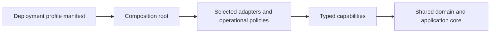

# Deployment Profiles

The canonical current state is the
[`deployment-profiles.yaml`](../../architecture/deployment-profiles/deployment-profiles.yaml)
manifest. This document defines semantics; it does not duplicate mutable
qualification evidence.

## Status vocabulary

```text
DESIGNED
  Identity, binding, placement, provisioning, failure, and recovery models admit
  the profile, and the manifest references the concrete design evidence set.
  No runnable composition is implied.

IMPLEMENTED
  A real composition root and required adapters exist, and implementation
  evidence is recorded. Production readiness is not implied.

QUALIFIED
  The implemented profile passed every required conformance, identity,
  isolation, persistence, security, restore, fencing, offline, and upgrade gate.
```

`IMPLEMENTED` and `QUALIFIED` are evidence-backed current states. A target release
cannot promote a profile. `QUALIFIED` points to an immutable, content-digested
record for one exact product authority, Orchestrator, AR, contracts, dependencies,
operating system, architecture, and topology release set. The immutable record
keeps the historical result; `reassessBy` controls current release/admission
readiness through an explicit time-aware gate.

For managed profiles the release set contains the Platform authority artifact.
For Local and Standalone profiles it contains the Standalone Authority artifact
instead; qualification never invents a Platform runtime dependency.

## V1 scope

| Profile | V1 scope |
| --- | --- |
| Local Standalone Desktop | Qualification target |
| Standalone Server | Qualification target |
| Managed Shared SaaS | Qualification target |
| Managed Dedicated | Design only |
| Managed BYOC | Design only |
| Hybrid Connected Runtime | Design only |

Current status and its evidence are intentionally not copied into this table.
They are read only from the machine-readable manifest.

The future profiles participate in identity, binding, placement, provisioning,
security, and failure matrices now. They do not receive speculative production
packages or composition roots in v1.

## Core invariant



Domain and application code cannot import cloud, provider, adapter, or
composition modules. Profile vocabulary is permitted only inside explicitly
registered owning Platform contexts such as future Placement or Deployment
Management; infrastructure selection remains outside their domain. Every other
context is forbidden from branching on profile names such as BYOC, Dedicated,
or Desktop. A composition profile selects infrastructure at the outer boundary
and supplies narrow typed capabilities. Capability negotiation never replaces
authorization.

Fallback is explicit failure. If a required capability is unavailable or
incompatible, startup or the owning operation fails with a typed outcome. The
system must not silently switch placement, authority, durability, or isolation.

## Scaling rules

- Stable Platform, Orchestrator, and AR identities do not encode region, host,
  cloud, profile, or endpoint.
- Placement and runtime bindings are versioned references with generations.
- Multiple runtime deployments are modeled as binding cardinality, not as a new
  domain implementation.
- Local, managed, customer-cloud, and connected-runtime compositions implement
  the same consumer-owned ports and pass the same semantic conformance suites.
- Operational differences such as HA, offline behavior, restore, upgrade owner,
  and secret custody remain adapter and deployment-policy concerns.
- A new profile starts as `DESIGNED`; promotion requires manifest evidence and a
  passing deterministic gate.
- A `DESIGNED` profile references existing design evidence. `IMPLEMENTED`
  additionally requires materialized composition and adapter packages plus real
  implementation evidence paths.
- Qualification records are append-only. A successor receives a new identity;
  the profile manifest stores the active record identity and content digest.
- All ten current qualification gates require `PASS`. Unsupported offline mode
  must prove bounded, safe disconnect behavior rather than use
  `NOT_APPLICABLE`.
- Gate evidence verifies named behavioral claims, including durable installation
  and Run operations, condition-based readiness, distinct lifecycle commands,
  diagnostics correlation, safe workspace custody, and absence of silent
  fallback. A document-only assertion cannot qualify a profile.
- The Project lifecycle and disposition gate proves terminal identity,
  owner-local freeze and disposition, truthful retained or unknown outcomes,
  and anti-resurrection behavior for the exact deployment profile. Managed
  Shared additionally proves cross-tenant isolation throughout offboarding.

## Enforcement

`pnpm architecture:check` validates the strict schema and lifecycle semantics.
It also uses the TypeScript AST to reject profile literals, profile-switch
identifiers, and inward imports from `domain/` or `application/` source. The
check is already active even though production source packages do not yet exist.
