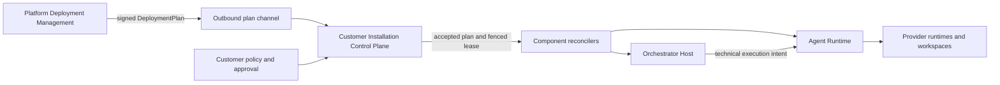
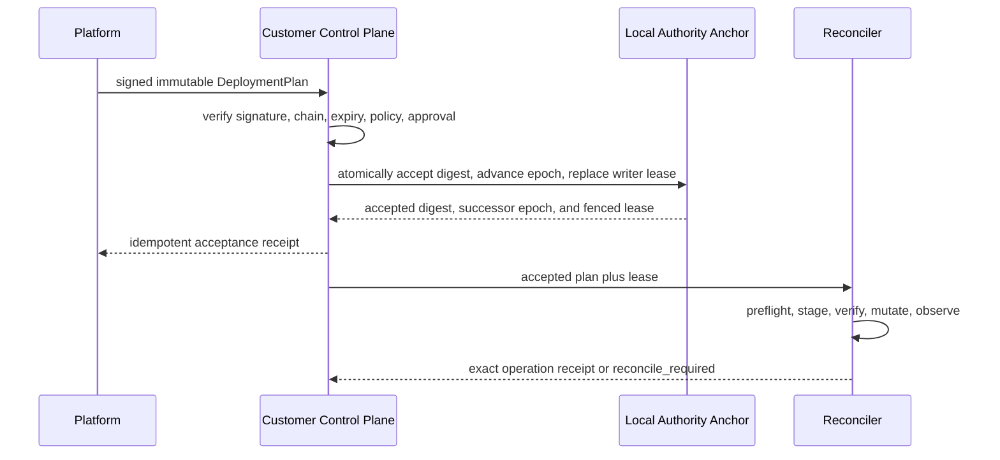

# Managed Installation Control

The canonical machine-readable policy is
[`managed-installation-policy.yaml`](../../architecture/managed-installation/managed-installation-policy.yaml).
This document explains its semantics without duplicating current profile status
or qualification evidence.

## Control topology



The customer control plane pulls desired state. Public endpoints do not permit a
request payload to select an authority realm, deployment, cloud account, or
writer. Enrollment and composition choose those bindings from trusted state.

## Distinct authority dimensions

These values are different types and never substitute for one another:

| Dimension | Owner | Meaning |
| --- | --- | --- |
| `PlatformDesiredRevision` | Platform | Ordered desired installation intent |
| `InstallationEnrollmentIncarnation` | Customer control plane | Successor identity after destructive or ambiguous loss of local authority continuity |
| `InstallationAuthorityEpoch` | Customer control plane | Monotonic local mutation authority |
| `InstallationWriterLease` | Customer control plane | Short-lived right for one reconciler generation to mutate |
| `RuntimeBindingGeneration` | Orchestrator | Selected Project-to-runtime binding lineage |
| `ARDeploymentAuthorityGeneration` | AR control plane | Technical runtime writer fencing |
| `RunAuthorityGeneration` | Run Orchestration | Product authority generation for one durable Run |
| `ExecutionAuthorityLease` | AR | Continued technical authority for accepted execution |

Advancing one dimension does not implicitly advance, revoke, or prove another.
Cross-boundary commands pin the exact dimensions they consume.

## Plan acceptance



The same plan identity and digest replay the prior receipt. The same identity
with different content is a hard conflict. Lost acknowledgement is recovered by
receipt query. External cloud or package operations are never performed inside
the local acceptance transaction.

## Durable operations

Installation operations retain:

```text
operationId
operationKind
acceptedPlanDigest
platformDesiredRevision
installationAuthorityEpoch
writerLeaseId
component and target generation
idempotency fingerprint
phase checkpoints
effect attempts and ambiguity state
cleanup obligations
receipts and diagnostic references
```

Operation status and installed-resource observation are separate. A process exit,
PID, HTTP response, or package-manager success is evidence, not completion by
itself. Unknown external acceptance enters reconciliation; it never triggers
blind replacement or duplicate installation.

## Readiness projection

The customer summary projects typed conditions:

- `Connectivity`;
- `ConfigurationSync`;
- `InstallationMutationAuthority`;
- `KmsAvailability`;
- `OrchestratorComponentHealth`;
- `ARControlPlaneComponentHealth`;
- `ProviderToolchainCompatibility`;
- `UpgradeStatus`;
- `DataDisposition`.

The projection may show `SETTING_UP`, `OPERATIONAL`, `DEGRADED`,
`ACTION_REQUIRED`, `DRAINING`, `SUSPENDED`, `QUARANTINED`, or `RETIRED`. A summary
never replaces condition evidence, accepted-plan authority, or component receipt.

## Upgrade and rollback

1. Resolve an immutable release set for exact OS and architecture.
2. Verify signatures, digests, provenance, SBOM references, compatibility, disk,
   privileges, network, and drain policy.
3. Stage without changing the active manifest.
4. Verify executables and contract handshake.
5. Drain or fence affected operations according to typed component policy.
6. Atomically activate the successor generation.
7. Observe health and publish an exact receipt.
8. Roll back only when data, contract, and authority continuity permit it.

No failed upgrade silently selects another profile, region, runtime, model, or
security posture. The last verified generation may remain active only when the
accepted plan and local policy explicitly permit it.

## Offline and recovery

- An unexpired accepted plan can be reconciled without a synchronous Platform
  call.
- No new authority expansion is accepted after required plan evidence expires.
- Existing Runs follow their own immutable authority basis and AR execution
  leases; the installation controller does not reinterpret or cancel them.
- A restored installation must prove accepted plan digest, local authority
  high-water mark, current signing key, and writer fencing against an anchor
  outside the restored database.
- Ambiguous or incompatible restore creates a new
  `InstallationEnrollmentIncarnation` and requires explicit reconciliation.
- Full offline rollback of a local machine plus all protected state cannot be
  detected absolutely without an external witness or hardware monotonic counter;
  qualification must state this threat-model limit.

## Security and custody

- Customer KMS or HSM owns non-exportable local keys; KMS does not replace the
  writer lease or monotonic authority anchor.
- Platform has no standing cloud-admin role, customer secret decryption path, or
  direct database authority.
- Bootstrap credentials are one-time, narrowly scoped, audience-bound, and
  expire after enrollment.
- Support access is customer-initiated, time-bounded, scoped, audited, and
  revocable. Customer-side redaction and preview occur before diagnostic export.
- Runtime provider authentication and secrets remain AR-owned technical
  capabilities. Platform sees only typed readiness and opaque references.

## Separation from Run execution

Installation Control ensures that compatible Orchestrator and AR components are
available. It never declares a Team or Run ready. Run Orchestration owns durable
Run intent, participant planning, admission, dispatch, cancellation, relaunch,
and aggregate readiness. AR owns provider acceptance, session readiness, output,
effects, containment, and recovery.

The old product's valuable cases become cross-system requirements:

- user-authored Team configuration survives a failed launch;
- a local-only UI autosave draft remains client-owned; a future collaborative
  server draft belongs to Team Topology and must publish an immutable
  `TeamVersion` before a Run can reference it;
- StartRun is idempotent and persists before external dispatch;
- participant readiness is independent and may be pending, blocked, failed,
  skipped, or confirmed;
- process liveness alone never proves bootstrap or provider readiness;
- auth retry does not repeat a first task when prior acceptance is unknown;
- cancellation retains ownership until runtime stop and secret cleanup receipts;
- relaunch creates an Orchestrator-owned successor execution-attempt identity or
  generation, never `RunAuthorityGeneration`, and tombstones stale evidence;
- worktree disposal is an explicit workspace operation, not process cleanup;
- diagnostics and operation history survive UI, CLI, controller, and host restart.

These are Orchestrator and AR conformance requirements. This Platform document
records the integration expectation but does not claim their domain ownership.

Installation disposition is also independent: uninstalling component software
does not retire ProductProject identity, delete an Orchestration Scope, prove AR
effect completion, revoke a provider account, or remove a worktree. It records
its own drain, fence, uninstall, retained-anchor, and diagnostic receipts.
