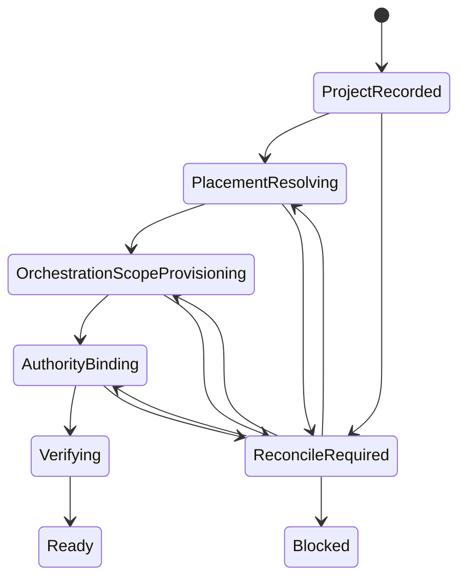
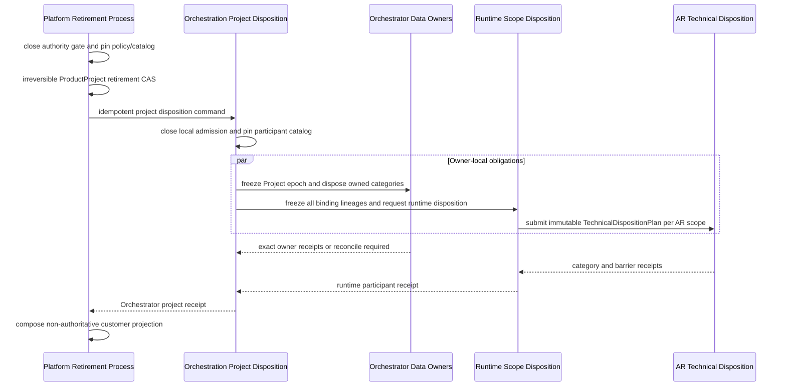

# Project Provisioning, Authority, and Retirement

Provisioning readiness, ProductProject identity, access authority, retirement
commitment, participant disposition, and evidence are deliberately separate.
No state in one axis asserts progress in another.

## Lifecycle vocabulary

This artifact models ProductProject creation and Orchestration Scope binding. It
does not model customer installation or Run execution. New designs use an
explicit lifecycle name:

| Lifecycle | Canonical terms | Owner |
| --- | --- | --- |
| Customer installation | `InstallationPlan`, `InstallationOperation`, `InstallationReconciliation`, `InstallationUpgrade`, `InstallationDisposition` | Platform Deployment Management for desired intent; Customer Installation Control Plane for local acceptance and execution |
| Orchestration scope | `ScopeAdmission`, `ScopeBinding` | Orchestration Scope |
| Run execution | `RunAdmission`, `RuntimeAllocation`, `ExecutionDispatch`, `RuntimeOperation`, `ExecutionRecovery` | Owning Orchestrator BC and AR across their published boundary |

The bare word `provisioning` must be qualified by the resource it creates. A
state or receipt from one lifecycle cannot serve as authority for another.

## ProductProject creation and Scope binding process



`ManagedProjectProvisioningProcess` owns these steps. ProductProject exists with
an `OPEN` identity before readiness, but admission remains closed until the
required Platform and Orchestrator authority gates allow it. Runtime provider
capacity is a separate readiness input. A read model may display
`PROVISIONING`, `READY`, or `BLOCKED`; those labels never mutate ProductProject.

## Authoritative resources and processes

| Status | Resource | Owner | Durable truth | Consistency and failure |
| --- | --- | --- | --- | --- |
| `CONFIRMED` | ProductProject | Platform Project Management | `OPEN` or terminal `RETIRED`, lifecycle revision, retirement epoch | Aggregate CAS, receipt, audit, and outbox in one Platform transaction |
| `CONFIRMED` | ProjectRestriction | Owning Platform authority capability through Project Management | Exact restriction identity, source, scope, revision, and status | One source clears only its exact restriction; stale or conflicting source revision fails closed |
| `CONFIRMED` | ProjectAdmissionAuthority | Platform Project Management | Effective gate, admission revision, lifecycle epoch | Restriction mutation and gate revision commit atomically |
| `PROPOSED` | ManagedProjectProvisioningProcess | Platform Provisioning | Operation ID, immutable request digest, and step receipts | Eventual convergence; unknown steps queried by stable ID |
| `CONFIRMED` | ProductProjectRetirementProcess | Platform Project Management | Commitment, policy and catalog revisions, participant obligations, opaque receipt refs | Cancel and commit race by ProductProject CAS; participant outcomes converge independently |
| `PROPOSED` | OrchestrationProject | Orchestration Scope | Stable identity, local admission authority, lifecycle and deletion epochs | Orchestrator-local CAS and owner-local outbox |
| `PROPOSED` | OrchestrationProjectDispositionProcess | Orchestration Scope | Versioned participant plan, owner obligations, exact receipt refs | Coordinates but never mutates another context's data |
| `PROPOSED` | RuntimeScopeBinding | Orchestration Scope | Binding ID, generation, opaque AR references | Desired-state commit followed by activation CAS; retirement fixes a generation high-water mark |
| `CONFIRMED` | ManagedRuntimeBinding | Run Orchestration | Participant and selected binding generation | Run-local commit; no unbounded operation or receipt collection |
| `CONFIRMED` | AR runtime-scope disposition | AR | AR-owned scope, cutoff, inventory, category actions, and technical receipts | Immutable technical plan, owner-local execution, truthful unknown and reconciliation |

## Product authority and retirement commitment

```text
ProductProject identity
  OPEN -> RETIRED

retirement commitment
  REVERSIBLE -> CANCELLED
  REVERSIBLE -> COMMITTED

participant obligation
  PENDING | EXECUTING | SATISFIED | POLICY_RETAINED
  | UNSUPPORTED | UNKNOWN | RECONCILE_REQUIRED
```

ProductProject creation, readiness, suspension, export, and disposition are not
ProductProject identity states. `SUSPENDED`, `Scheduled for deletion`, `Cleanup
in progress`, and `Deletion verified` are projections over separate sources.

A retirement request installs one exact retirement restriction. Cancellation is
allowed only while commitment is `REVERSIBLE` and removes only that restriction.
The irreversible commit compare-and-swaps the current ProductProject revision,
sets `RETIRED`, advances the retirement epoch, records the operation receipt,
and appends the outbox in one transaction. The same identity never returns to
`OPEN`, even if no downstream erase has started.

## Hierarchical disposition



Each arrow is a versioned idempotent boundary. Platform treats Orchestrator as
one participant and never imports its internal participant catalog. Orchestrator
treats each owning context and runtime-scope disposition as separate
participants. AR receives only its normalized technical plan.

There is no global `QUIESCING -> INVENTORY -> DISPOSING -> VERIFYING` authority.
Each owner first commits a local freeze against the supplied deletion epoch and
its own revision. The freeze closes delayed and queued writes that were admitted
earlier. Inventory and irreversible actions begin only after that owner's freeze
receipt.

All active and historical RuntimeScopeBinding generations and deployment
incarnations inside the resurrection horizon participate. Retirement closes
creation and rebind through the same OrchestrationProject lifecycle authority
and fixes the binding-index high-water mark used by bounded fan-out.

## Policy and evidence

The product policy snapshot pins intent, source, version, and opaque evidence.
It is not perpetual erase authority. Immediately before each irreversible owner
action, a fresh typed authorization binds resource epoch, category, action,
owner, expected revision, and validity. A new or unknown hold produces retention
plus reconciliation without reopening product or runtime access.

Detailed receipts stay owner-local. Coordinators retain only obligation state,
canonical command/digest identity, and opaque receipt references. Feeds may
announce progress but cannot prove completion; lost acknowledgement is recovered
by exact receipt query or replay.

`POLICY_RETAINED` requires positive policy evidence and a durable follow-up for
retention expiry. `UNKNOWN`, `UNSUPPORTED`, missing backup coverage, shared-key
uncertainty, and unknown provider residue do not become verified deletion.

## Catalog and upgrade rules

- Participant and data-category catalogs are static, typed, versioned, and
  release-governed; runtime plugin discovery is forbidden.
- A new writer cannot be released until it handles retired epochs, returns a
  disposition or verified-absence receipt, and is registered in the catalog.
- An in-flight process pins its catalog and plan revisions. A newly mandatory
  participant is added through an immutable append-only supplement.
- Rolling upgrades support prior plan, command, and receipt versions through the
  declared retirement and restore horizon.
- Minimal tombstones and retirement epochs outlive command retries, delayed
  events, callbacks, stale workers, backup restore, and PITR replay.
- Hosted restore checks a monotonic retirement anchor outside the restored
  backup domain before admission. Local Standalone documents its weaker full-
  machine rollback threat model.

## Workspace, credentials, and keys

- External user-owned source is `UNLINK_ONLY`.
- Workspace Registry alone may dispose a managed clone, worktree, snapshot, or
  execution allocation that the system owns. Managed clones and worktrees
  default to `RETAIN`; destructive disposition additionally requires dirty-state
  evidence, typed policy, and explicit authorization.
- Runtime sandboxes remain AR-owned.
- A shared credential is detached, not globally revoked.
- Private customer content is not cross-tenant deduplicated in v1.
- `crypto_erase` requires exclusive key scope and complete encrypted-copy
  coverage.
- Break-glass can fence, stop, quarantine, retry, and reconcile, but cannot
  remove holds, rewrite evidence, reopen retired identity, or claim completion.

## Required failure traces

1. Concurrent create with one command ID produces one Project and one Operation.
2. Lost Orchestrator response is recovered by the original Project creation
   operation ID.
3. Platform commit with Orchestrator unavailable remains visible and
   reconcilable; no distributed rollback removes ProductProject.
4. Independent billing and security restrictions cannot clear each other.
5. Retirement cancellation racing irreversible commit has exactly one CAS
   winner.
6. A queued write accepted before upstream retirement loses against the local
   owner freeze or is included below its high-water mark.
7. A legal hold arriving after plan creation but before erase wins the last-mile
   authorization check.
8. Runtime rebind racing retirement is either rejected by the lifecycle CAS or
   included in the fixed binding lineage.
9. A new data-owning release is blocked until its catalog, tombstone, and
   disposition conformance exists.
10. Feed gap or lost acknowledgement recovers through exact receipt query, not a
    replacement command.
11. A restored backup cannot recreate Project admission, binding authority, or
    disposed payload.
12. Tenant retirement racing Project creation is serialized by the Tenant epoch
    and project-index high-water mark.
13. External workspace source survives Project retirement. Owned allocations
    follow typed disposition; managed clones and worktrees remain retained by
    default until destructive authorization and evidence exist.
14. Provider `not_found`, unreachable BYOC, missing backup evidence, or shared
    key scope cannot produce verified deletion.
15. UI or CLI disconnect leaves a durable Project or installation operation
    running; only an explicit idempotent cancellation command may stop it.
16. A process-alive observation cannot mark a scope, participant, provider, or
    installation ready. Required readiness lanes report independently.
17. Lost acknowledgement after AR or customer-control-plane acceptance is
    resolved by the original operation ID and semantic fingerprint, never by a
    replacement create, launch, install, or update command.
18. Relaunch, retry, rollback, recovery, cancellation, and disposition remain
    distinct typed commands with independent authorization and receipts.

Cross-tenant transfer remains `UNSUPPORTED_V1`. Standalone-to-managed migration
creates new product and orchestration identities by default. Managed Dedicated,
BYOC, Hybrid, multi-region active-active retirement, configurable retention,
legal-hold UI, compliance export, and deletion certificates remain profile- or
capability-specific follow-up work.
